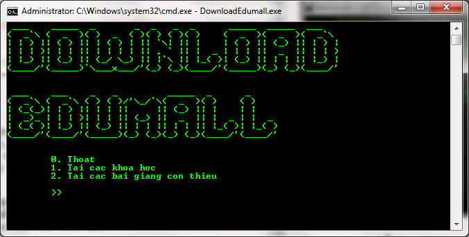
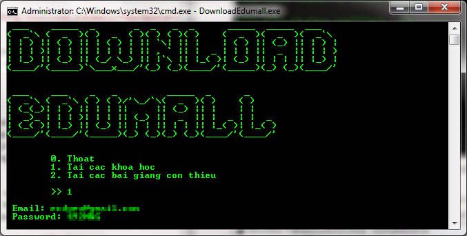
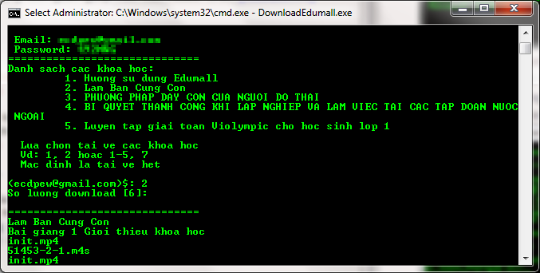
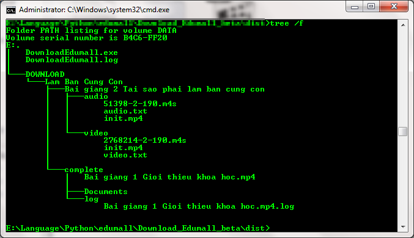
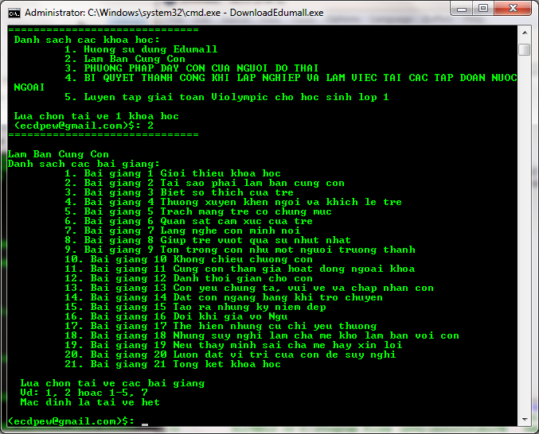
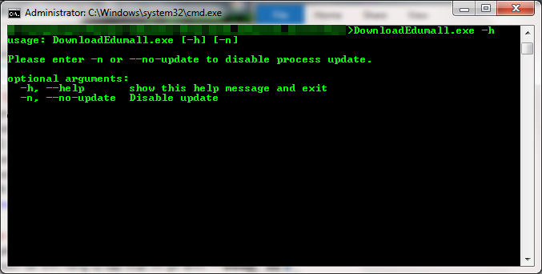

# DOWNLOAD EDUMALL

Download Edumall là ứng dụng đơn giản giúp tải các video trên [edumall.vn](https://edumall.vn/)

# Hướng dẫn sử dụng:
## 1. Link tải: [Tải](https://github.com/NguyenKhong/Download_Edumall_beta/raw/master/dist/DownloadEdumall.exe)
## 2. Các tính năng:
* Tải video các khóa học hiện đang có trong tài khoản.
* Tải các bài giảng còn thiếu trong một khóa học nhất định.
### 2.1 Tải các khóa học:
* Chọn 1, enter
* Nhập email và password.

* Chọn một hoặc nhiều khóa học bất kì. Mặc định bỏ trống và Enter là tải về tất cả các khóa học. Ví dụ 1 hoặc 1,3,5 hoặc 1-10 hoặc bỏ trống.
* Tiếp theo nhập số luồng tải về cùng lúc. Mặc định bỏ trống và enter là 6 luồng.( *Lời khuyên tùy vào tốc độ mạng mà chọn số luồng phù hợp, và số luồng nên <= 10*)

* Quá trình tải mất từ vài phút đến hàng giờ tùy vào từng khóa học, có bao gồm việc tải các tệp tin đính kèm ở mỗi bài học. Sau khi tải các tập tin video nhỏ sẽ được ghép lại thành mp4 và lưu trong thư mục với cấu trúc sau:

### 2.2 Tải các bài giảng còn thiếu trong một khóa học nhất định.
 Tùy chọn này giúp tải các bài giảng còn thiếu nếu trong tùy chọn 1 không tải về được vì một nguyên nhân nào đó.
* Chọn 2, Enter.
* Lựa chọn duy nhất 1 khóa học.
* Lựa chọn tải về 1 hoặc nhiều bài giảng. Mặc định bỏ trống và enter thì sẽ tải về hết. Ví dụ: 1 hoặc 3, 5 hoặc 1-10. 

##3. Cập nhật:
* Sau ngày 05/09/2019 phần mềm có thêm tính năng tự cập nhật.
* Sau khi cập nhật sẽ tạo ra tập tin ***DownloadEdumall.old.exe*** đây là phiên bản cũ, nếu không cần thiết thì bạn có thể xóa nó.
* Nếu muốn tắt tính năng tự cập nhật thì gõ lệnh: ***DowloadEdumall.exe -n***
* Thông tin thêm:

## 4. Lưu ý:
* Sau khi tải về các bài giảng, vào các thư mục **DOWNLOAD/Tên khóa học/Complete/** để lấy các video bài giảng và các tệp đính kèm.
* Nếu sau khi tải mà còn thiếu video thì mở tập tin **DownloadEdumall.log**, có dòng chữ sau ***WARNING: [hlsnativethread] download key decrypt failed*** thì hãy chắc chắn video thuộc bài giảng đó xem được trên trình duyệt thì mới tải về được. (*Do nhà phát triển hơi lười nên lâu lâu mới vào xem, các bạn thông cảm.*)
